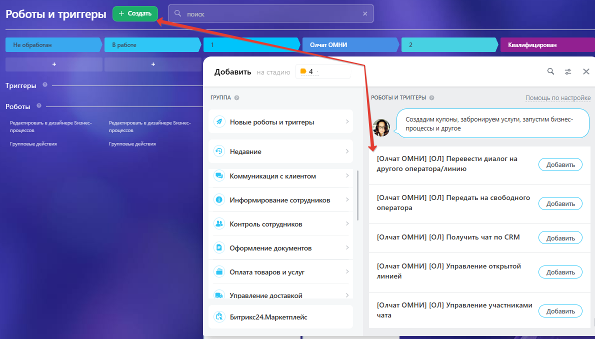

# REST API

REST API позволяет автоматизировать отправку/получение сообщений, работу с чатами и интеграцию с внешними системами.


Сейчас API находится в тестовом режиме — структура и методы могут измениться.&#x20;


Полная и актуальная документация по всем методам REST API доступна напрямую в вашем кабинете: **Олчат ОМНИ** → выберите аккаунт из списка → **Настройки** → **Вебхук** → **Документация API**.

<figure><figcaption></figcaption></figure>

<figure><figcaption></figcaption></figure>

## Получение вебхука (токена)

1. Зайдите в приложение Олчат ОМНИ.
2. Выберите нужный коннектор (Telegram или МАКС).
3. Перейдите в **Настройки коннектора → Вебхук**.
4. Нажмите **Сгенерировать новый** и скопируйте токен.

## Особенности API

* Большинство методов поддерживают GET-запросы для простоты.
* Параметры чувствительны к формату (например, номера телефонов, chat\_id для Telegram).
* Существуют ограничения на частоту запросов.
* send\_to\_imol (Y/N) — публиковать ли сообщение в чат Открытой линии Bitrix24.
* Для Telegram используются **chat\_id** (или username), для МАКС — номера/идентификаторы.

## Основные возможности&#x20;

* Отправка текстовых сообщений (sendText).
* Отправка файлов/медиа (sendFile).
* Проверка статуса линии (checkStatus).
* Проверка статуса сообщения (checkMessageStatus).
* Получение последних входящих/исходящих сообщений (lastIncomingMessages, lastOutgoingMessages).
* И другие методы (проверка аккаунта, работа с чатами и т.д.).

Все параметры, ограничения по частоте запросов, особенности для Telegram и МАКС, примеры ответов и ошибок подробно описаны в официальной документации API.
