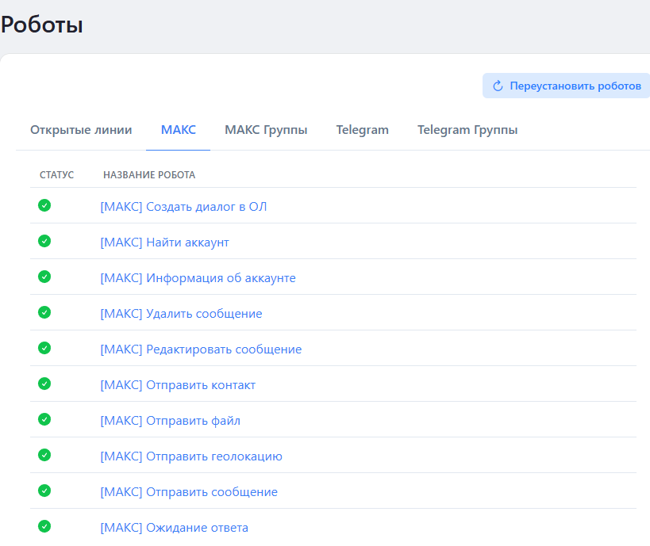
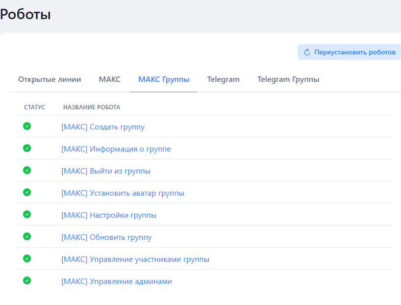

# МАКС

Роботы МАКС Олчат ОМНИ предназначены для автоматизации работы с диалогами и групповыми чатами в мессенджере МАКС (MAX) в рамках интеграции с Битрикс24.

С их помощью можно автоматизировать создание диалогов, отправку различных типов контента, управление аккаунтами и группами, а также выполнять другие служебные действия, снижая ручную работу операторов и администраторов.

## Основное назначение

Роботы МАКС выполняются автоматически в рамках настроенных бизнес-процессов Битрикс24. Они срабатывают при переходе лида, сделки или другого объекта CRM на определённую стадию, а также могут использоваться в сценариях автоматизации коммуникаций через мессенджер МАКС.

### Задачи роботов МАКС

* Автоматизировать создание и управление диалогами в МАКС.
* Отправлять сообщения, файлы, контакты, геолокацию и другие типы контента.
* Получать информацию об аккаунтах и группах для дальнейшей обработки.
* Управлять групповыми чатами (создание, обновление, управление участниками и администраторами).
* Выполнять служебные действия, такие как редактирование, удаление сообщений и выход из групп.
* Снижать ручную нагрузку на сотрудников при работе с каналом МАКС.


Роботы не предназначены для прямого общения с клиентами вместо оператора. Их основная роль — выполнение технических и административных действий в диалогах и группах МАКС.&#x20;


## Доступные роботы МАКС

Роботы делятся на две категории: для индивидуальных диалогов и для работы с групповыми чатами.

### Обычные роботы

<figure><figcaption></figcaption></figure>

### Роботы для групп

<figure><figcaption></figcaption></figure>

### Рекомендации по использованию

* Используйте роботы в комбинации с данными CRM (лиды, сделки, контакты) для персонализированной автоматизации.
* Для групповых сценариев применяйте роботы с пометкой «группы».
* Тестируйте сценарии в тестовых диалогах перед внедрением в рабочие процессы.
