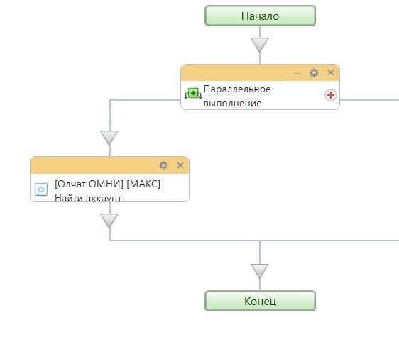
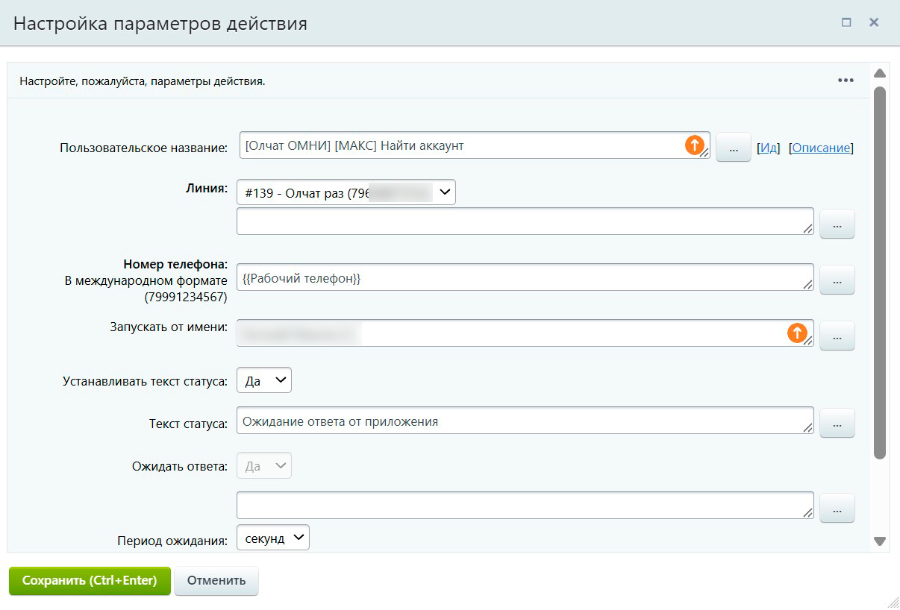
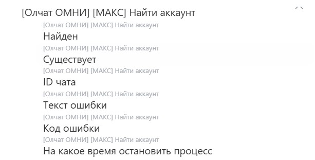

# Найти аккаунт

## Настройка робота

Для поиска аккаунта в Олчат ОМНИ добавьте робота **«\[Олчат ОМНИ] \[МАКС] Найти аккаунт»**.

Для этого перейдите в **Роботы → Создать → Выбор стадии → Другие роботы → \[Олчат ОМНИ] \[МАКС] Найти аккаунт → Добавить.**

<figure><figcaption></figcaption></figure>

Выполните настройку робота. Для этого на добавленном роботе нажмите кнопку **Изменить**:

1. В поле **Линия коннектора** укажите линию Олчат ОМНИ, через которую будет выполняться поиск.
2. В поле **Номер телефона** укажите номер телефона в международном формате или выберите поле сущности (через 3 точки) в котором у вас хранится номер.
3. В поле **Запускать от имени** по умолчанию указан администратор. Вы можете добавить других сотрудников.
4. Нажмите кнопку **СОХРАНИТЬ**.

<figure><figcaption></figcaption></figure>

## Настройка активити (действия) бизнес-процесса

Для поиска аккаунта в бизнес-процессах добавьте действие **\[Олчат ОМНИ] \[МАКС] Найти аккаунт**.

<figure><figcaption></figcaption></figure>

Выполните настройку параметров действия:

1. В поле **Линия** укажите линию Олчат ОМНИ.
2. В поле **Номер телефона** укажите номер в международном формате  или выберите поле сущности (через 3 точки) в котором у вас хранится номер.
3. Остальные настройки можно оставить по умолчанию. Нажмите кнопку **СОХРАНИТЬ**.

<figure><figcaption></figcaption></figure>


Вся информация о пользователе МАКС, которую можно использовать в дальнейших сценариях автоматизации, будет содержаться в дополнительных результатах робота или активити.


<figure><figcaption></figcaption></figure>

<figure><figcaption></figcaption></figure>
